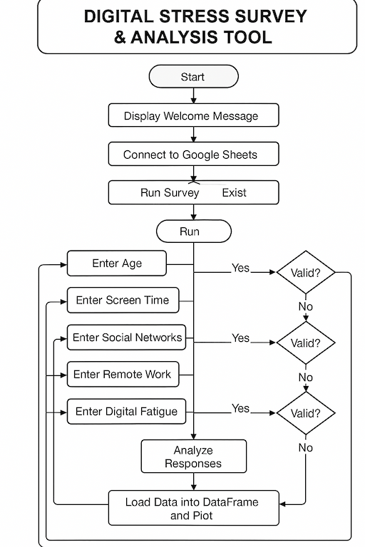

# 📊 Project3 pyhton – stress-sm-p3py

## Code Institute - Second Milestone Project: User-Centric Frontend Development

## 🔗 Live Demo  
[👉 Try it live on Heroku](https://stress-sm-p3py-6b1a0e94ecd6.herokuapp.com/)

---

Stress-sm-p3py is a python code deployed in heroku.

# 📋 Table of Contents
- [🧾 Project Overview](#🧾-project-overview)
<!--
- [📱 Am I Responsive? - Demo](#📱-am-i-responsive---demo)
-->
- [🎯 UX](#🎯-ux)
- [🧑‍💼 User Stories](#🧑‍💼-user-stories)
- [🎨 Design Choices](#🎨-design-choices)
- [📐 Five Planes UXD](#📐-five-planes-uxd)
  - [📌 Strategy](#📌-strategy)
  - [📐 Scope](#📐-scope)
  - [🏗️ Structure](#🏗️-structure)
  - [🦴 Skeleton](#🦴-skeleton)
  - [🎨 Surface](#🎨-surface)
- [🛠️ Technologies & Design Choices](#🛠️-technologies--design-choices)
- [✨ Features](#✨-features)
  - [🚀 Existing Features](#🚀-existing-features)
  - [🔮 Features Left to Implement](#🔮-features-left-to-implement)
  - [🧑‍💻 Languages Used](#🧑‍💻-languages-used)
  - [🧰 Frameworks, Libraries & Programs Used](#🧰-frameworks-libraries--programs-used)
- [🧪 Testing & Validation](#🧪-testing--validation)
  <!--
  - [✅ Browser & Device Testing](#✅-browser--device-testing)
  -->
  - [✅ Validator Testing](#✅-validator-testing)
  <!--
  - [✅ Accessibility Testing](#✅-accessibility-testing)
  - [✅ Console in Google Chrome DevTools-"Inspect" Testing](#✅-console-in-google-chrome-devtools-inspect-testing)
  -->
  - [🧑‍💻 Testing User Stories – User Experience (UX) Evaluation](#🧑‍💻-testing-user-stories--user-experience-ux-evaluation)
  - [🐞 Bugs](#🐞-bugs)
  - [📥 Deployment](#📥-deployment)
  - [🌐 GitHub Pages Deployment](#🌐-github-pages-deployment)
  - [🍴 Forking the GitHub Repository](#🍴-forking-the-github-repository)
  - [📂 Making a Local Clone](#📂-making-a-local-clone)
- [🙏 Credits & Acknowledgements](#🙏-credits--acknowledgements)

---

## 🧾 Project Overview
stress-sm-p3py is a terminal-based survey to measure digital fatigue and stress.

---

## 🎯 UX
### Target Audience:
1. Professionals and remote workers – people experiencing screen fatigue or tech overload.
2. Students and digital natives – who use social media and games heavily.
3. Mental health coaches or digital wellness advocates – interested in simple tools for tracking digital habits.

### Core UX Goals:

1. Build trust and clarity through a guided, conversational CLI experience
Use clear prompts, validation feedback, and a welcoming tone to help users feel comfortable sharing personal info.
2. Deliver fast, interactive feedback based on user input
Instantly return personalized and group-based recommendations to reinforce user engagement and learning.
3. Make results actionable and motivating
Encourage digital wellness with tailored advice (e.g., “Try screen breaks,” “Do offline hobbies”) that users can immediately apply.
4. Design for inclusivity and accessibility in text-based environments
Keep questions simple, jargon-free, and keyboard-navigable for all reading levels and users, including non-native English speakers.
5. Create potential for future growth (e.g., web app, gamification, dashboards)
Lay the groundwork for expanding into more dynamic formats or professional use (e.g., coaches, teachers).

### Main Site Goals:

- Promote digital wellness by helping users understand the impact of screen time, social media, and tech fatigue on their stress levels
- Offer instant, personalized and group recommendations based on individual habits and emotional feedback
- Encourage self-reflection through a short, engaging survey with zero judgment and simple language
- Present group-level comparisons to help users see how their habits align with or differ from peers
- Securely store all data in Google Sheets, enabling future analysis, usage tracking, or reporting
- (Coming Soon) Build a simple web-based version for broader accessibility and visual enhancements
- (Coming Soon) Add a “Stress Tracker” dashboard that visualizes personal trends over time and recommends habit adjustments

---

## 🧑‍💼 User Stories
- My Goal as Developer:
  As the sole developer of this Python-based app, my mission is to create a smooth, insightful, and interactive experience that helps users better understand how digital habits affect their stress levels. The tool should feel helpful, safe, and informative — encouraging users to reflect on their digital well-being and take actionable steps to improve it.

- User Experience Objectives:
From the user's perspective, this app is designed with the following key goals:
  - I want to complete the survey quickly and clearly without confusion.
  - I need the instructions and questions to be easy to understand and answer.
  - I appreciate seeing my results visually and getting meaningful feedback right away.
  - I want to feel that my answers are confidential and respected.
  - I should be able to revisit and see my progress (optional for future enhancement).

  ### First-Time Visitor Goals

  - As a first-time user:
      1. I want to understand what this survey is about and how it will help me.
      2. I would like to complete the survey in under 5–10 minutes.
      3. I want to receive personalized feedback or recommendations based on my answers.
      4. I want reassurance that my data is treated respectfully and securely.

  ### Returning Visitor Goals
 
  - As a returning user:
      1. I want to take the survey again and compare results over time (if available).
      2. I would like to see insights based on other users’ averages vs. mine.
      3. I may want to receive a summary of my responses and tips.

  ### Frequent User Goals

  - As a frequent user:
      1. I want to track my digital stress patterns and improvements.
      2. I want visual summaries (e.g., bar charts) comparing my screen time, app usage, and stress over time.
      3. I want to explore wellness tips, exercises, or links to mindfulness apps for support.

---

## 🎨 Design Choices
  ### Description
  This command-line Python app is thoughtfully designed to guide users through a quick and insightful survey that explores the relationship between digital habits and stress levels. While the interface is minimal, the user experience is intentionally structured to feel conversational, supportive, and meaningful. The goal is not only to collect data, but to help users reflect and take action on their digital wellness.

  #### Key Design Principles
  1. User-Centered Flow:
     The questions follow a logical and empathetic order — starting with basic habits and gently leading into emotional well-being — ensuring users never feel overwhelmed or judged.

  2. Clarity & Simplicity:
     Instructions and questions are short, jargon-free, and formatted with consistent spacing for readability in the terminal.

  3. Immediate Feedback:
     Upon completion, users receive personalized summaries, visual graphs (via Matplotlib), and practical recommendations based on their responses.

  4. Purposeful Interactivity:
     Users engage in a step-by-step format that feels natural and smooth, including options to skip non-relevant sections and retry invalid inputs without frustration.

  5. Visual & Analytical Layer:
     While text-based in interaction, the app enhances insights with bar graphs that compare the user’s habits to average data from others — making results feel more relevant and motivating.

  6. Trust & Privacy Focus:
     The app communicates clearly that responses are stored securely in Google Sheets (with no personal identifiers), reinforcing user confidence in sharing honest answers.

## 📐 Five planes UXD

### 📌 Strategy
The goal of this project is to help users evaluate their digital stress levels and receive personalized recommendations. The app is built with clarity, ease of use, and meaningful feedback at its core—making it both functional and insightful.

### 📐 Scope
The application targets two key audiences:

First-time users: 
Can complete a quick survey, receive immediate results and feedback, and explore wellness tips or trends based on their responses.

Returning users: 
Can compare past entries, observe trends in their digital habits, and access actionable suggestions for reducing digital fatigue or improving well-being.

Key features include:

- Digital stress survey
- Personalized recommendations
- Automatic chart generation from user data
- Optional comparison with previous scores
- View summaries via Google Sheets integration

### 🏗️ Structure
The structure of the application was planned around a smooth, user-friendly experience via the terminal (CLI), with potential to scale into a web app.

Core Functional Areas:

1. Welcome Section – Brief introduction and user prompt
2. Survey – 8+ questions covering screen time, emotional states, fatigue, exercise, etc.
3. Result Calculation – Based on weighted input
4. Feedback & Tips – Tailored results with stress-reduction suggestions
5. Data Logging – Responses stored in Google Sheets
6. Graph Output – Visual insight into digital stress using Matplotlib

### 🦴 Skeleton
The system logic follows a clear, linear flow, with decision-making trees and structured question routing based on user inputs. Error handling ensures data integrity, and repeated use is encouraged by storing timestamps and results for future comparisons.

Planned Enhancements:
- Add progress tracking
- Option to download a PDF summary
- Provide external links to resources like mindfulness apps or articles

#### Flowchart

### 🎨 Surface
The CLI interface is designed for simplicity and clarity using structured prompts, progress indicators, and color-coded feedback (where supported). If expanded into a GUI, a soft palette of calming blues and greens would be used to reflect wellness, balance, and trust.

---

## 🛠️ Technologies & Design Choices
1. **Python** – The core programming language used to build the digital stress survey, manage logic, handle user input, and communicate with external APIs.
2. **gspread & Google Sheets API** – Enables secure storage of user responses in a connected Google Sheet, allowing for data logging, analysis, and comparisons over time.
3. **Matplotlib & Pandas** – Libraries used to analyze the collected data and generate visualizations such as bar charts, helping users interpret their digital stress results.
4. **Heroku** – Cloud platform used for project deployment, providing users access to the application in a live terminal environment.

---

## ✨ Features

### 🚀 Existing Features

  ### Digital Stress Survey
  A command-line survey that asks users about screen time, social media use, emotional well-being, and lifestyle habits to evaluate digital stress levels.
  Start with a welcome message and a brief explanation.

  
  ---

  ### Errors validation
  Errors detected and feedback to user to answer the correct data.

  **Age error validation**

  
   

  **Screen time error validation**

  
   

  **Social Networks error validation**

  
   

  **Work/Study from home? validation error**

  
   

  **Digital fatigue error validation**

  
   

  **Stress level error validation**

  
  ---

  ### Personalized Feedback
  Based on user answers, the program generates tailored insights and practical recommendations to help reduce digital fatigue and improve wellness.
  

  ### Visual Charts
  Using Matplotlib, the app generates bar charts that help users understand their digital behavior and stress impact in a visual, easy-to-read format.
  

  ### Data Logging via Google Sheets
  Every survey submission is stored securely in a connected Google Sheet using the `gspread` library, allowing for long-term tracking and analysis.
  

  ### Automatic Score Calculation  
  The app calculates a digital stress score using weighted inputs across several areas, offering objective, data-driven feedback.

  ### Deployed on Heroku 
  The application is hosted online using Heroku, making it accessible from any device with internet access and a terminal interface.

  ### Clear User Prompts
  Friendly, easy-to-follow instructions guide users through the survey, even if they are not tech-savvy.

  ### Repeatable Use
  Users can retake the survey multiple times, and new results will be stored alongside previous entries for ongoing self-assessment.

---

### 🔮 Features Left to Implement

1. **PDF Summary Export (Coming Soon)**  
   Users will be able to download a PDF summary of their responses, results, and wellness recommendations for personal tracking or sharing with a health professional.

2. **Historical Trends Dashboard**  
   A feature to visualize stress patterns over time using saved data from multiple entries (e.g., line graphs comparing past scores).

3. **Web App Interface**  
   Expand the current CLI tool into a browser-accessible version with buttons, forms, and interactive charts using Flask or Django.

4. **Email Reports (Optional)**  
   Option to send results and wellness tips to the user’s email after completing the survey.

5. **Smart Tips Based on Age Group**  
   Deliver more personalized feedback and wellness strategies based on the user's age bracket.

6. **External Resource Integration**  
   Include links to guided meditation apps, breathing exercises, or curated articles based on user’s stress level.

7. **Timestamped Submissions (Commig Soon)**  
  Each entry is logged with a date and time, enabling users to compare past and present results to monitor trends and improvement.

---

## 🧑‍💻 Languages Used
-   [Python 3](https://www.python.org/doc/) – Main programming language used to build the logic and functionality of the digital stress survey.
-   [Markdown](https://en.wikipedia.org/wiki/Markdown) – Used to create this README file with clear formatting and structure.

---

## 🧰 Frameworks, Libraries & Programs Used
1. [Git](https://git-scm.com/)
    - Git was used for version control by utilizing the Gitpod terminal to commit to Git and Push to GitHub.
2. [GitHub:](https://github.com/)
3. [Visual Studio Code:](https://code.visualstudio.com/)
    - Visual Studio Code for code editor with AI.
    - GitHub is used to store the projects code after being pushed from Git.
4. [Heroku:](https://id.heroku.com/login)
5. [CI Python Linter:](https://pep8ci.herokuapp.com/)
    - Python Validator (pep8ci)
6. [Youtube](https://www.youtube.com/)
    - YouTube
7. [W3 Schools]( https://www.w3schools.com/)
    - W3 Schools

---

## 🧪 Testing & Validation
### ✅ Browser & Device Testing  
- Web browsers: Chrome, Firefox, Safari, and Microsoft Edge.
-  On mobile devices: iPhone 13 Mini, Pixel 7 Pro.
-  On laptops: MacBook Pro 14”, MacBook Pro 16”.

---

### ✅ Validator Testing

  ### Python: CI Python Linter [https://pep8ci.herokuapp.com/]

  These tools ensured that all pages were free of syntax errors and followed best coding practices.
  

---

<!--
### ✅ Accessibility Testing
- Lighthouse DevTools by Google
### Home Page and Quiz Flow
  #### Home Page: [`index.html`](index.html)
  

  ---

### ✅ Console in Google Chrome DevTools-"Inspect" Testing
- Console Error Testing using Google Chrome DevTools

  Each page was tested via the Console tab in Chrome's Developer Tools to detect and resolve any JavaScript or resource-related issues. All known 404, syntax, or runtime errors were addressed, ensuring a clean console output across the site.
-->

### 🧑‍💻 Testing User Stories – User Experience (UX) Evaluation

#### First-Time Visitor Goals

🔰 First-Time Visitor Goals
1. **Understand the Survey’s Purpose Quickly**
    - Upon arrival, users are welcomed with a clear introduction to the survey’s goals: understanding the connection between digital habits and stress.
    - A brief overview explains how the app works, why it's beneficial, and how the results can support digital well-being.

2. **Complete the Survey in Under 5–10 Minutes**
    - The survey is intentionally designed to be short and focused, taking no longer than 5–10 minutes to complete.

    - Questions use plain, user-friendly language with simple input formats (e.g., numbers, yes/no, checkboxes) to minimize time and confusion.

3. **Receive Personalized Feedback Based on Answers**
    - After submission, users receive immediate, meaningful feedback through data visualizations and tailored recommendations.

    - Compare user responses to group averages, and tips are dynamically generated to support improved digital wellness.

4. **Feel Confident That Data is Handled Respectfully and Securely**
    - Users are assured that their responses are anonymous, not shared with third parties, and stored securely.

    - A short message before the survey reinforces the privacy policy and encourages honest participation without fear of judgment.

---

#### Returning Visitor Goals

As a Returning Visitor, I want to:

1. **Take the Survey Again and Compare Results Over Time**  
   - Returning users can easily access the survey to reflect on their digital stress habits periodically.  
   - While full history tracking may be a future enhancement, users are encouraged to retake the survey and note changes manually for now.

2. **See Insights Based on Group Averages**  
   - Results include comparisons between the user’s data and aggregated averages from all previous submissions.  
   - This helps users understand how their digital habits align with broader trends and whether they fall within healthy ranges.

3. **Receive a Summary of Responses and Tips**  
   - Users have the option to review a summary of their answers directly on-screen.  
   - *(Optional future feature)* Exportable or email-ready summaries may be included to help users track personal progress and apply wellness tips more effectively.

---

#### Frequent User Goals

As a Frequent User, I want to:
1. **Track Digital Stress Patterns and Improvements**  
   - Frequent users can regularly complete the survey to reflect on progress and changes in their digital stress habits.  
   - This encourages awareness and motivates ongoing self-improvement over time.

2. **View Visual Summaries of Key Metrics**  
   - The app provides information to compare screen time, app usage (e.g., social media, games), and stress levels.  
   - These visuals help users understand their digital behavior trends in a clear and engaging way.

3. **Explore Wellness Tips and Mindfulness Support**  
   - Users are presented with actionable wellness tips based on their results.  
   - *(Optional future enhancement)* Integration with external resources such as mindfulness apps, breathing exercises, or digital detox guides may be included for deeper support.

#### Further Testing
- The Python-based survey was rigorously tested in **multiple terminal environments** (macOS Terminal, Windows Command Prompt, VS Code terminal) to confirm compatibility and proper console rendering.
- Cross-platform testing was carried out on **Windows, macOS, and Linux**, ensuring consistent functionality regardless of the user’s operating system.
- The survey was also tested on **Heroku’s cloud-based interface**, verifying that **Google Sheets integration**, **data storage**, and **graph generation (via Matplotlib)** worked seamlessly in the deployed environment.
- Functionality tests confirmed that:
  - All **survey input prompts** accepted expected responses and handled invalid inputs gracefully.
  - **Graphs and visual feedback** were generated correctly based on user data.
  - **Google Sheets updates** occurred in real-time with appropriate data validation.
- **UX testing** was conducted with a small group of users (ages 18–55) who provided feedback on the **clarity of questions**, **usefulness of recommendations**, and **overall flow** of the survey.
- Suggestions from testers led to improvements in:
  - Labeling and feedback for input errors  
  - Layout and clarity of the survey output  
  - Enhanced tips based on stress levels and screen time results

---

### 🐞 Bugs
### Solved Bugs
- Fixed a bug where invalid user inputs (e.g., text instead of numbers) caused the program to crash — added input validation with user-friendly error messages.
- Resolved an issue where survey results were not being saved correctly to **Google Sheets** due to incorrect column indexing.
- Corrected logic in stress-level feedback: users with minimal screen time were previously receiving incorrect high-stress recommendations.
- Removed redundant variables and cleaned up unused imports to improve code readability and efficiency.
- Verified that no exceptions appear in the terminal or on Heroku deployment logs after full survey completion.
- Improved wording and grammar in survey prompts and feedback messages for better UX clarity and professionalism.

---
### Unsolved Bugs / Areas for Improvement
- **Survey restart flow**: Currently, users must manually restart the script to retake the survey. A built-in "Retake Survey" option would improve usability.
- **Data overwrite risk**: There's a minor risk of overwriting rows in Google Sheets if manual edits are made directly in the sheet without preserving structure.
- **Graph display on some environments**: On rare occasions, the Matplotlib graph window fails to open in certain headless or minimal-terminal environments (e.g., some Linux setups or cloud-based IDEs).
- **No authentication for repeated entries**: Users can take the survey multiple times without any session tracking. Future improvements could include a timestamp or user ID column to track submissions.
- **Limited mobile support**: Since this is a terminal-based app, mobile users may not be able to interact without a physical keyboard or SSH terminal app.
- **UI limitations**: Although the console interface works well, a future web-based version with buttons, sliders, and real-time feedback would improve accessibility and visual appeal.

---

## 📥 Deployment

### 🌐 GitHub Pages Deployment (For Frontend Projects)

The project was successfully deployed to **GitHub Pages** using the steps below:

1. Log in to GitHub and open your project’s [repository](https://github.com/).
2. At the top of the repository (below the repo name, not the site header), click on the **"Settings"** tab.
   - Alternatively, view a GIF tutorial by clicking [Link to GitHub Docs](https://raw.githubusercontent.com/).
3. In the left-hand sidebar under **"Code and Automation"**, click on **"Pages"**.
4. On the GitHub Pages screen, scroll down to the **"Source"** section.
5. Click the dropdown that says **"None"** and select **"Master Branch"** (or **"main"**, if that's your default).
6. The page will refresh automatically and display the deployment status.
7. Scroll down again to find the live URL of your published site under the **"GitHub Pages"** section.
   - Example: [https://your-username.github.io/your-repo-name](https://github.com)

You can now access your project live on the web using the provided GitHub Pages URL.

### 🍴 Forking the GitHub Repository

  Forking a GitHub repository allows you to create a personal copy of the original project in your own GitHub account. This enables you to freely explore, modify, or contribute without affecting the original codebase. Follow these steps:

  1. Log in to GitHub and open the target [GitHub Repository](https://github.com/).
  2. At the top-right corner of the repository page (just above the "Settings" tab), click the **"Fork"** button.
  3. GitHub will create a copy of the repository under your own account.
  4. You can now freely edit, update, and experiment within your forked version without impacting the original repository.

### 📂 Making a Local Clone

  Follow these steps to create a local copy of the repository on your machine:
   
  1. Log in to GitHub and navigate to the target [GitHub Repository](https://github.com/).
  2. Below the repository name, click the **"Code"** button (formerly "Clone or download").
  3. Under **"Clone with HTTPS"**, copy the provided URL.
  4. Open **Git Bash** (or your terminal of choice).
  5. Change the current working directory to the location where you want the cloned project to reside.
  6. Type the following command and paste the URL you copied in Step 3:
  
    git clone https://github.com/YOUR-USERNAME/YOUR-REPOSITORY

  7. Press Enter. Git will create a full local clone of the repository:

    $ git clone https://github.com/YOUR-USERNAME/YOUR-REPOSITORY

  Cloning into 'project-folder'or `CI-Clone`...
  remote: Counting objects: 10, done.
  remote: Compressing objects: 100% (8/8), done.
  remote: Total 10 (delta 1), reused 10 (delta 1)
  Unpacking objects: 100% (10/10), done.
  

📎 For additional guidance and visual steps, visit GitHub’s official help guide:
Cloning a repository – GitHub Docs

This is the Code Institute student template for deploying your third portfolio project, the Python command-line project. The last update to this file was: **May 14, 2024**

### Reminders

- Your code must be placed in the `run.py` file
- Your dependencies must be placed in the `requirements.txt` file
- Do not edit any of the other files or your code may not deploy properly

### 🚀 Heroku Deployment (For Python Backend Project)

The Python-based Digital Stress Survey was deployed to **Heroku** using the following steps:

1. Ensure your project includes the following essential files:
   - `requirements.txt` — listing all dependencies (e.g., `gspread`, `matplotlib`, `pandas`, etc.)
   - `Procfile` — containing the command to run your app (e.g., `python app.py`)
   - `runtime.txt` — specifying the Python version (e.g., `python-3.11.4`)
   - `creds.json` — your Google Sheets API credentials (added securely via Heroku config vars, **not committed** to GitHub)

2. Push your final project to GitHub.

3. Log in to your [Heroku dashboard](https://dashboard.heroku.com/) and follow these steps:
   - Click **“New” → “Create new app”**.
   - Choose a unique app name and select your region.
   - Click **Create app**.
      - #### Creating the Heroku app

        When you create the app, you will need to add two buildpacks from the _Settings_ tab. The ordering is as follows:

        1. `heroku/python`
        2. `heroku/nodejs`

        You must then create a _Config Var_ called `PORT`. Set this to `8000`

        If you have credentials, such as in the Love Sandwiches project, you must create another _Config Var_ called `CREDS` and paste the JSON into the value field.

Connect your GitHub repository and deploy as normal.

4. Under **"Deploy"**, choose **GitHub** as the deployment method.
   - Connect your GitHub account if prompted.
   - Search for and connect your repository.
   - #### Constraints
      The deployment terminal is set to 80 columns by 24 rows. That means that each line of text needs to be 80 characters or less otherwise it will be wrapped onto a second line.

5. Scroll down to **Manual Deploy** and click **Deploy Branch**.
   - Once complete, click **View App** to launch your live Python survey.

6. (Optional but recommended) Go to **Settings → Config Vars** and:
   - Add your Google Sheets API credentials (`CREDS`) as a JSON string.
   - Add any environment variables needed securely here.

> Your app is now live on Heroku and ready to collect survey data and display insights!

---

## 🙏 Credits & Acknowledgements
* Code Institute

### Code, Resources & References

- [Google](https://www.google.com)  
  Utilized for general development research, code examples, and technical clarification.

### 📚 Content

- The **survey structure**, question flow, and recommendations were designed and written by the developer based on personal research and user testing.

- I used the Code Institute’s projects as inspiration for flow and formatting:
  - [Love Sandwiches](https://github.com/Code-Institute-Solutions/love-sandwiches-p5-sourcecode
Public)
  - [Love Sandwiches](https://github.com/cynthiapinedoh79/love_sandwiches)

- Survey questions were influenced by research into **digital wellness**, **screen fatigue**, and **behavioral psychology**.

- 🧠 **Educational & Research Sources** that inspired the stress evaluation and feedback logic:
  1. [Verywell Mind – Digital Stress and Mental Health](https://www.verywellmind.com/)
  2. [American Psychological Association – Stress in America Report](https://www.apa.org/news/press/releases/stress)
  3. [Harvard Health – Technology and Mental Health](https://www.health.harvard.edu/)
  4. [World Health Organization – Digital Health and Wellbeing](https://www.who.int/health-topics/digital-health)
  5. [Psychology Today – Screen Time Effects](https://www.psychologytoday.com/us/topics/screen-time)

---

### Media
- [unsplash](https://unsplash.com/)

### 🙏 Acknowledgements

- I would like to express my sincere gratitude to the **Code Institute support team** (mentor, tutor and Student Care) for their unwavering guidance and encouragement throughout the development of this project.
- A special thanks to my mentor, Medale Oluwafemi, whose insightful advice, constructive feedback, and continuous support were instrumental to my progress.
- Appreciation to the Code Institute Slack community for their valuable assistance and shared insights during moments of challenge.
- My heartfelt thanks go to **Code Institute** for offering an exceptional course that laid the foundation for this project and significantly advanced my learning journey.
- Finally, I was inspired by the diverse and creative example projects showcased by **Code Institute**, which helped shape and refine the vision for my own work.

---

